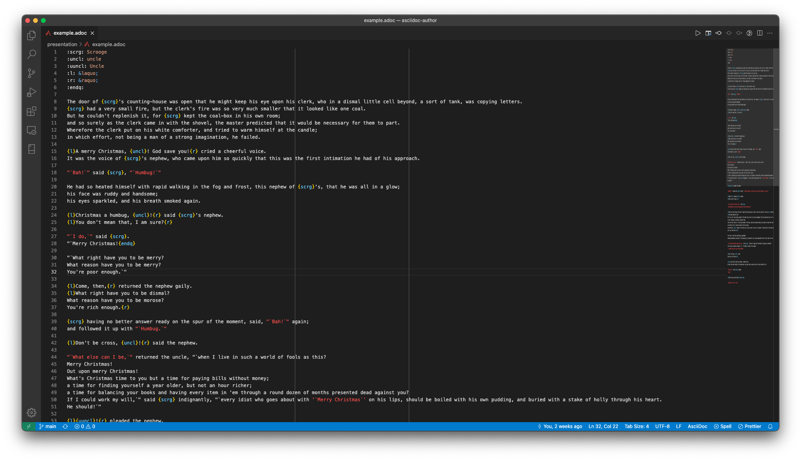

# AsciiDoc Author


A few tiny pushes to make AsciiDoc authoring in VSCode more fun, especially when you're writing [one sentence per line](https://asciidoctor.org/docs/asciidoc-recommended-practices/#one-sentence-per-line). A few of the features:

-   Multi-line quote support
-   Formatting for `{l}` and `{r}` as quote attributes if you're using non-standard quotes
-   Bold, italic, and attribute highlighting within quote strings

## Before



## After


**Note** that this extension provides syntax tokens, not formatting. For that you'll need something like the following in your `settings.json`:

```
"editor.tokenColorCustomizations": {
	"textMateRules": [
		{
			"scope": "markup.substitution.attribute-reference.asciidoc",
			"settings": {
				"foreground": "#66ccff"
			}
		},
		{
			"scope": "markup.italic.quote.typographic-quotes",
			"settings": {
				"foreground": "#FF4D4D",
				"fontStyle": ""
			}
		},
		{
			"scope": "markup.italic.quote.typographic-quotes.attribute-assigned-multiline.asciidoc",
			"settings": {
				"foreground": "#AA80FF"
			}
		},
		{
			"scope": "text.asciidoc.author.punctuation",
			"settings": {
				"foreground": "#79d279"
			}
		}
	]
}
```

For more info, check out the [Syntax Highlighting Guide](https://code.visualstudio.com/api/language-extensions/syntax-highlight-guide) and the [TextMate grammar reference](https://macromates.com/manual/en/language_grammars).

Happy authoring!
