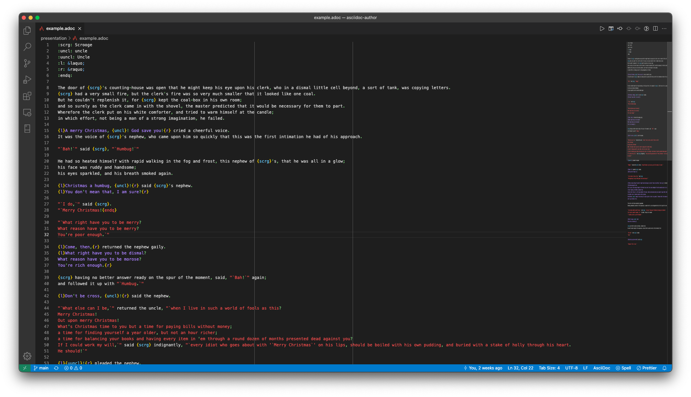

# AsciiDoc Author


A few tiny pushes to make AsciiDoc authoring in VSCode more fun, especially when you're writing [one sentence per line](https://asciidoctor.org/docs/asciidoc-recommended-practices/#one-sentence-per-line). Think of it as syntax highlighting for your manuscript. 🎨

A few of the features:

-   Bold, italic, and attribute highlighting within quote strings
-   Formatting for punctuation
-   Multi-line quote support
-   Formatting for `{l}` and `{r}` as quote attributes if you're using non-standard quotes
-   A `{endq}` operator to end any quote (_e.g._ `` "`Hello,{endq} he said politely. ``)
    -   VSCode likes to match opening tags with closing tags for syntax highlighting, which doesn't work well for multi-paragraph quotes in conventional authoring. The `{endq}` attribute tells VSCode not to worry about matching the opening quote to a closing quote, which sorts the issue. To use it, define `{endq}` as an empty attribute in your document and place it at the end of your hanging quotes:

```
:endq:

"`So you think that money is the root of all evil?`" said Francisco d’Aconia.
"`Have you ever asked what is the root of money?
Money is a tool of exchange, which can’t exist unless there are goods produced and men able to produce them.
Money is the material shape of the principle that men who wish to deal with one another must deal by trade and give value for value.
Money is not the tool of the moochers, who claim your product by tears, or of the looters, who take it from you by force.
Money is made possible only by the men who produce.
Is this what you consider evil?{endq}

"`When you accept money in payment for your effort, you do so only on the conviction that you will exchange it for the product of the effort of others.
It is not the moochers or the looters who give value to money.
Not an ocean of tears nor all the guns in the world can transform those pieces of paper in your wallet into the bread you will need to survive tomorrow.
Those pieces of paper, which should have been gold, are a token of honor--your claim upon the energy of the men who produce.
Your wallet is your statement of hope that somewhere in the world around you there are men who will not default on that moral principle which is the root of money.
Is this what you consider evil?`"
```

## Before


## After



**Note** that this extension provides syntax tokens, not formatting. For that you'll need something like the following in your `settings.json`:

```
"editor.tokenColorCustomizations": {
	"textMateRules": [
		{
			"scope": "markup.substitution.attribute-reference.asciidoc",
			"settings": {
				"foreground": "#66ccff"
			}
		},
		{
			"scope": "markup.italic.quote.typographic-quotes",
			"settings": {
				"foreground": "#FF4D4D",
				"fontStyle": ""
			}
		},
		{
			"scope": "markup.italic.quote.typographic-quotes.multiline.attribute-assigned.asciidoc",
			"settings": {
				"foreground": "#AA80FF"
			}
		},
		{
			"scope": "text.asciidoc.author.punctuation",
			"settings": {
				"foreground": "#79d279"
			}
		}
	]
}
```

For more info, check out the [Syntax Highlighting Guide](https://code.visualstudio.com/api/language-extensions/syntax-highlight-guide) and the [TextMate grammar reference](https://macromates.com/manual/en/language_grammars).

Happy authoring!
